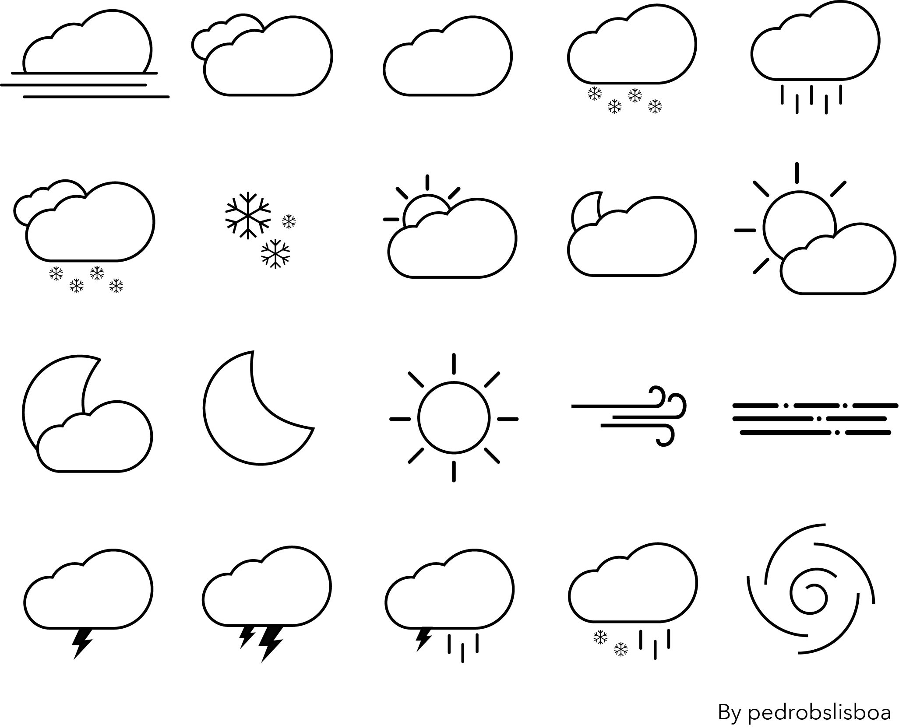
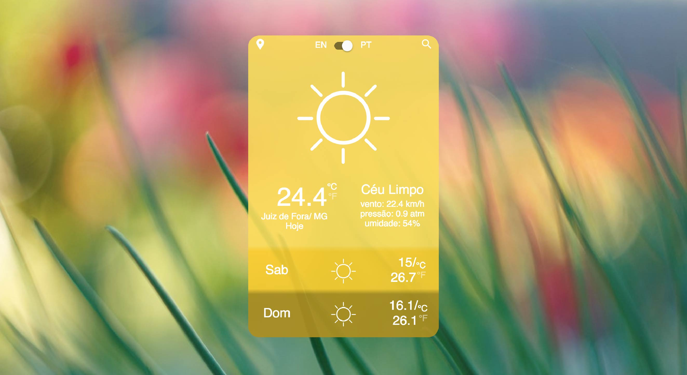

#English introduction

Please view[README-EN.md](https://github.com/pedrobslisboa/challenge-charlie/blob/master/README-EN.md)

----
# Desafio Charlie / Hotel Hurbano -> Usando React, Redux

Weather SPA totalmente em português e com icones desenhados por mim, toda e interface é responsiva, incluindo fontes. 

Icones:

  

Screenshot:

  

Não quer executar em sua máquina? Sem problemas, aqui está uma demo no Heroku:   https://weatherapp-hotelurbano.herokuapp.com/

Para executar:
- Clone o repositório
- Instale as dependencias: `npm istall`
- Rode a aplicação: `npm start`

Notas: 
- ATENÇÃO: Todos os commits com 'Pós Pull Request' tem como objetivo manter o código atualizado e funcional, bem como adicionar melhorias e consertar pequenos erros verificados, mesmo sabendo que o pull request já foi feito. O prefixo 'Pós Pull Request' tem como objetivo informar ao avaliador que os seguintes Commits foram feitos depois do Pull Request, ficando a critério levar ou não em consideração esses. Foi apenas feito como forma de boa prática para evitar prática de 'malandragem' e mesmo assim manter um código funcional e atualizado no meu Git e portifólio. ATENÇÃO!!!!! O commit 'Consertando errors menores de procura', também foi feito após o Pull, e faltou o prefixo por falta de atenção minha.
- O bing não permite mais COR, então foi utilizado o daily picture do unsplash.
- O Antigo README pode ser encontrado em README.old.md

