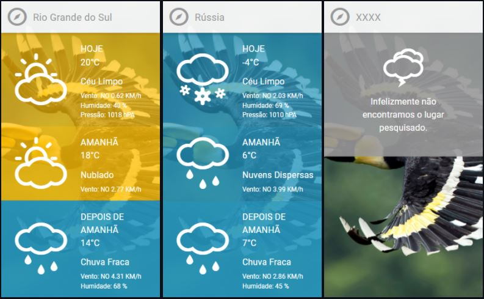

# Challenge Charlie

### Descrição

Criação de um projeto que possa realizar previsões do tempo por geolocalicação e busca pelo nome.


## Layout

<p align="center">
 
</p>


## Escolhas Técnicas

- **Meterial-UI** - Utilizado para construção do layout.
- **NodeJS** - Utilizado para construir o backend da aplicação, para solucionar o problema de  `CORS policy` e para acesso único também, foi criado um minimo de segurança, é necessário enviar no header uma chave de autenticação, para então poder consumir a API.

## Explicação do funcionamento do componente
O componente é configurado pelo arquivo "describes.json", ou seja, realizada a a leitura dessa arquivo para construção de labels e exibição do icone para os respectivos dias.
A ideia e tentar deixar o máximo flexivel, por exemplo, no layout original não existe a exibição do icone de temperatura para os dias "amanhã" e "depois de amanhã", dessa forma basta eu informar se eu quero exibir o icone somente alterando a propriedade para o respectivo dia..

```json
 weather.day[x].config.showIcon = true
``` 

## Exemplo de configuração do componente
```java
{
    "weather":{
        "messages":{
            // Mensagem quando não encontrar um lugar.
            "placeNotFound":"Infelizmente não encontramos o lugar pesquisado.", 
            // Texto place holder do campo de busca
            "placeHolder":"Informe um lugar."
        },
        //Configurações dos dias
        "days":{
            "today":{
                "config":{
                    // Name do dia
                    "name":"Hoje",
                    // Exibir o ícone, se não houve a tag não será exibido.
                    "showIcon":true
                },
                // Definição dos labels com seus respectivos campos
                // No momento só aceita campos que retornam da API
                "labels":{
                    "description":"{description}",
                    "wind_speed":"Vento: NO {wind_speed} KM/h",
                    "humidity":"Humidade: {humidity} %",
                    "pressure":"Pressão: {pressure} hPA"
                }
            },
            "tomorrow":{
                "config":{
                    // Name do dia
                    "name":"Amanhã",
                    // Exibir o ícone, se não houve a tag não será exibido.
                    "showIcon":true
                },
                // Definição dos labels com seus respectivos campos
                // No momento só aceita campos que retornam da API
                "labels":{
                    "description":"{description}",
                    "wind_speed":"Vento: NO {wind_speed} KM/h"
                }
            },
            "after_tomorrow":{
                "config":{
                    // Name do dia
                    "name":"Depois de amanhã",
                    // Exibir o ícone, se não houve a tag não será exibido.
                    "showIcon":false
                },
                // Definição dos labels com seus respectivos campos
                // No momento só aceita campos que retornam da API
                "labels":{
                    "description":"{description}",
                    "wind_speed":"Vento: NO {wind_speed} KM/h",
                    "humidity":"Humidade: {humidity} %"
                }
            }
        }
    }
}
```

## Resultado com a configuração acima
<p align="center">
  
</p>

## Rodando o projeto
```
  npm start
```

## Rodando os tests
```
  npm run test
```

## API
O backend da aplicação foi criado em `NodeJS`, usando biblioteca `Express`.
Atualmente ela se encontra já em um ambiente de testes, `http://challenge-hurb.herokuapp.com`

```java
  [URL]: http://challenge-hurb.herokuapp.com
  [APP_ID]: MIGfMA0GCSqGSIb3DQEBAQUAA4GNADCBiQKBgQCh7uxHjWd1CyRgPD4XHcIPKiDb
```

- **/bing** [GET] - Endpoint responsável por retornar a imagem do dia do Bing.com.
- **/weather** [GET]- Endpoint responsável pela busca por nome ou por geo localização, seus parâmetros são `localname`, `latitude` e `longiture`.


## Exemplo de como consumir API
```java
var request = require('request');
var options = {
  'method': 'GET',
  'url': 'https://challenge-hurb.herokuapp.com/weather?localname=Rio de Janeiro',
  'headers': {
    'x-app-id': MIGfMA0GCSqGSIb3DQEBAQUAA4GNADCBiQKBgQCh7uxHjWd1CyRgPD4XHcIPKiDb
  }
};
request(options, function (error, response) {
  if (error) throw new Error(error);
  console.log(response.body);
});

```
## Resposta da API
```java
{
    "city": "Rio de Janeiro",
    "days": {
        "today": {
            "dt": 1621368760,
            "sunrise": 1621329611,
            "sunset": 1621369116,
            "temp": 23.05,
            "feels_like": 23.19,
            "pressure": 1015,
            "humidity": 68,
            "dew_point": 16.83,
            "uvi": 0,
            "clouds": 75,
            "visibility": 10000,
            "wind_speed": 4.63,
            "wind_deg": 200,
            "weather": [
                {
                    "id": 803,
                    "main": "Clouds",
                    "description": "nuvens quebradas",
                    "icon": "04d"
                }
            ],
            "description": "nuvens quebradas"
        },
        "tomorrow": {
            "weather": [
                {
                    "id": 803,
                    "main": "Clouds",
                    "description": "nuvens quebradas",
                    "icon": "04d"
                }
            ],
            "wind_speed": 3.09,
            "humidity": 63,
            "temp": 23.31,
            "description": "nuvens quebradas"
        },
        "after_tomorrow": {
            "weather": [
                {
                    "id": 800,
                    "main": "Clear",
                    "description": "céu limpo",
                    "icon": "01d"
                }
            ],
            "wind_speed": 3.33,
            "humidity": 64,
            "temp": 24.14,
            "description": "céu limpo"
        }
    }
}
```