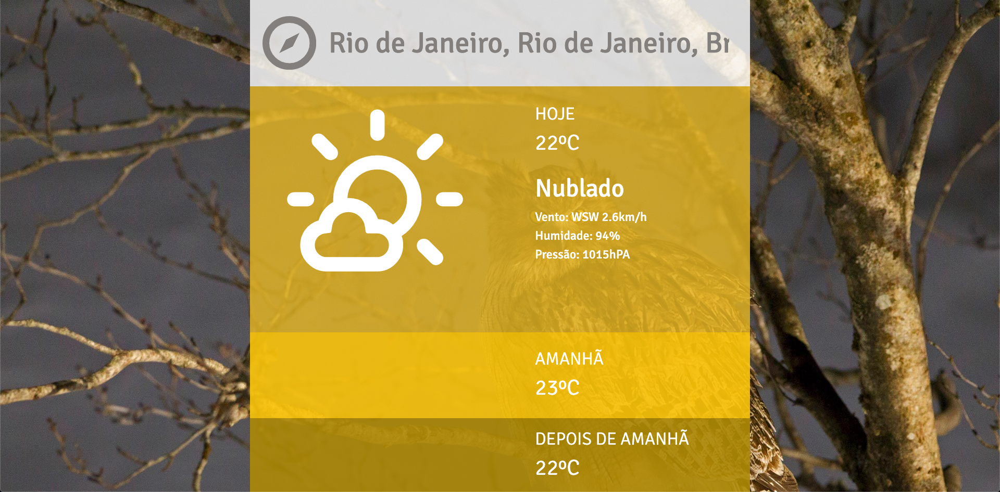
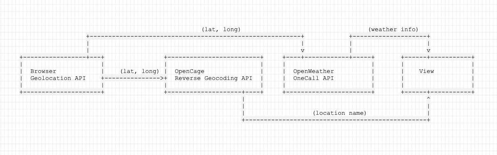
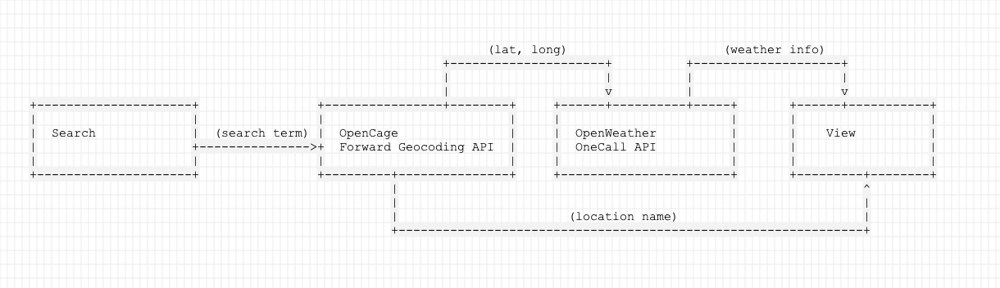

# Challenge Charlie Hurb - Erik Tronkos

> Microsite that displays and queries weather information (for more info go to [REQUIREMENTS.md](./REQUIREMENTS.md))



## Installation

Recommended NodeJS v12+

```sh
yarn install
```

## Usage

_Follow installation instructions before proceeding_

#### Without Docker

Development build (localhost:3002)

```sh
yarn dev
```

Production build (localhost:3000)

```sh
yarn build
yarn start
```

#### With Docker

Development build (localhost:3002)

```sh
docker-compose -f docker-compose.dev.yml up
```

Production build (localhost:3000)

```sh
docker-compose up
```

## Testing

This project includes E2E tests to ensure required functionalities are working.

_Follow installation instructions before proceeding_

#### Running tests (without GUI)

```sh
yarn cypress:test
```

#### Running tests (with GUI)

```sh
yarn cypress:test-open
```

### Test results video

The video of the tests being run is [here](/cypress/videos/Templates/Weather/Weather.spec.ts.mp4)

## Comments and Caveats

- The request to fetch the background image on bing is only made server-side, because it is now protected by CORS
- The provided icons library was not used because it seemed the icons were not correctly indexed to the weather ID's provided by openWeather. [This](http://erikflowers.github.io/weather-icons) library was used instead.
- The provided openWeather endpoint provided only current weather info, but we also needed future temperature info. The openWeather endpoint that provides all this info uses coordinates as parameters.
  Because of that the request flow had to be changed to:

  - Using geolocation <br>
    

  - Using search <br>
    
