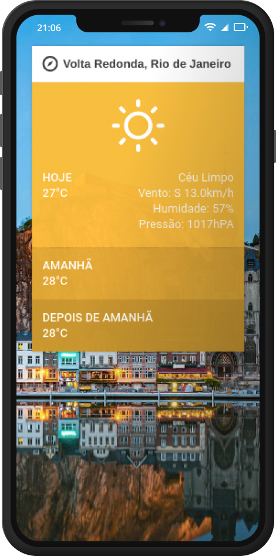
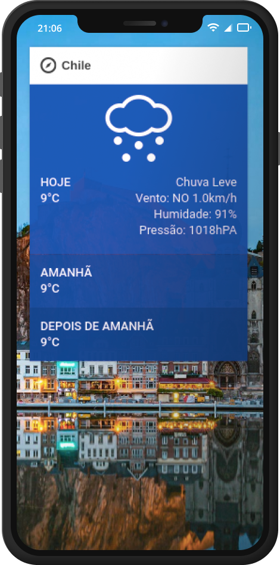

<h2 align="center">
  
  Desafio Charlie
</h2>

<h1 align="center">
  
  
</h1>

#### 📜 Sobre

Este é um microsite responsivo feito em ReactJS como parte de um desafio de front-end, chamado Desafio Charlie. A proposta desse pequeno site é exibir para o usuário as informações sobre como está o tempo em sua localidade (desde que o usuário tenha permitido o acesso a sua localização) ou qualquer outra. É exibido em tela informações sobre o exato momento pesquisado e para os próximos 2 dias.

#### 🚦 Requisitos
`:TODO:`

#### :airplane: Rodando a aplicação
`:TODO:`

#### 🧰 Escolhas Técnicas

**Create React App** - Foi utilizado esta ferramenta para tirar dos ombros do desenvolvedor o tempo gasto com configuração de webpack e etc, restando mais tempo para ser gasto com o desenvolvimento da aplicação em sí.

**TypeScript** - A decisão de usar TypeScript foi para, em ambiente de desenvolvimento, ter mais clareza do que está sendo feito passado como argumento, retorno e etc. Isto reduz as chances de usar uma variável, função ou componente de forma errada. Além de claro, trazer uma inteligência maior para o editor de texto (Visual Studio Code no caso).

**ESLint e Prettier** - Estas ferramentas foram escolhidas para que em ambiente de desenvolvimento o código esteja organizado e padronizado sempre da mesma maneira (2 espaços, camelcase e etc.).

**SWR** - A escolha de usar SWR foi para o usuário ter uma experiência de navegação melhor. O SWR é uma biblioteca que faz um cache das requisições em memória (e em storage aliado coma biblioteca **swr-sync-storage**). Assim, os dados que já foram vistos antes vem de forma quase instantânea e os novos dados vem logo em seguida substituindo-os. O principal motivo para o uso dessa biblioteca foi para a imagem de fundo que demorava para carregar pois não é uma imagem fixa e nem local.

    com 💜 Luiz Gustavo

