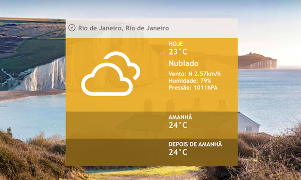

<br />
<div align="center">
  <h2 align="center">Charlie Challenge </h2>
  <p align="center">
   Weather Forecast based on your location or any other place you'd like to be. :)
  </p>
</div>

# Screenshot

<h1 align="center">
  
</h1>

## Running

```bash
make proxy
make prod
```

Open [http://localhost:8080](http://localhost:8080) to view it in the browser.

## Local development

This project relies on:

- Docker
- Conventional commit (git hooks with [Husky](https://github.com/typicode/husky))
- Storybook
- Jest

### Running locally

- Get Proxy running

```bash
make proxy
```

- Start the app

```bash
make dev
```

Open [https://localhost:3000](https://localhost:3000) to view it in the browser.

### Storybook

```bash
make storybook
```

Open [http://localhost:6006](http://localhost:6006) to view it in the browser.

### Testing

- Running tests

```bash
make test
```

- Test coverage

```bash
make coverage-test
```
