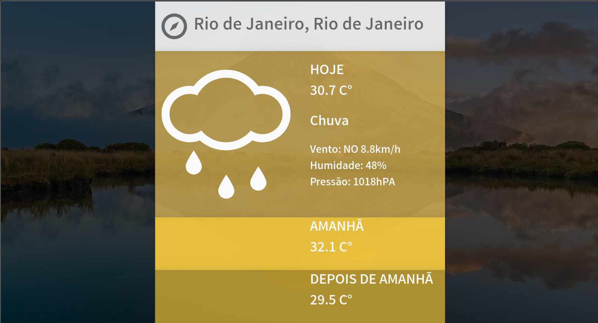

# Desafio Charlie

### **No ar neste [Link](https://hardcore-neumann-6c08e4.netlify.app/)**

Aplicação que pega as coordenadas geográficas (se autorizado), e retorna informações de clima e tempo através de um card. Caso o usuário queira verificar outras cidades, basta digitar na parte superior do card a cidade desejada, que também será retornada as informações pertinentes à ela. A aplicação só permite a pesquisa por cidades, indicando cidade inválida caso fuja deste padrão. Clicar na temperatura a trocará para a escala Fahrenheit, e ao clicar de novo volta para o Celsius. O card assume a cor azul para temperaturas abaixo de 15 graus °C e a correspondência em °F. Assume a cor vermelha para temperaturas maiores que 35°C e entre esses valores fica amarela.

## Rodando o projeto

Para rodar o projeto localmente, será necessário instalar as dependências descritas no arquivo `package.json` :

`npm install`

Após isso, basta iniciar o servidor:

`npm start`

Para rodar a versão de produção:

`npm run build`

A versão otimizada para produção estará na pasta **build**, que será gerada no processo.

Com docker, para rodar a imagem feita para ambiente de desenvolvimento, basta rodar o seguinte código:

`docker-compose -f docker-compose.dev.yml up`

Para produção:

`docker-compose up`

Endereço da aplicação: `http://localhost:8080`

Rodando testes:

`npm run test`

## Sobre o projeto

### Escolhas técnicas

> -   Preferencialmente faça em React, mas você pode usar outras bibliotecas ou frameworks (Angular, Vue.js, etc) ou JavaScript puro (Vanilla JS).

O framework escolhido, como o recomendado, foi o React.
Para haver o gerencialmento de estado entre os componentes criados, foi utilizada a Context API, desacoplando chamadas à API e algumas regras de negócios dos arquivos responsáveis pela renderização.

> -   Para a folha de estilo, você pode usar o que preferir (CSS, SASS, LESS, CSS Modules, CSS-in-JS, etc).

Para a parte de estilo, escolhi o SASS. Mesmo pensando que em pequenos projetos não faria muita diferença a escolha, acredito que o SASS tem uma escalabilidade interessante, por ser facilmente integrável com outros frameworks, além de ser extremamente flexível quanto ao uso global ou uso modular. Também acredito que seja de mais fácil compreensão em renovações de equipes, já que existe à muito tempo e continua largamente utilizado nas grandes empresas.

> -   Preferencialmente use Webpack. Se preferir, você pode usar [create-react-app](https://github.com/facebook/create-react-app) ou similares. Fazer o próprio setup do Webpack da pontos extras.

Como recomendado foi utilizado Webpack + Babel para execução do projeto.

> -   É interessante que sua aplicação esteja pronta para produção. Criar no Docker um `stage` para produção e um para desenvolvimento da pontos extras.

foram criados dois arquivos: `docker-compose.dev.yml`, responsável pelo ambiente de desenvolvimento e o `docker-compose.yml` para produção. Ambos contém instruções para rodar os seus Dockerfile.dev e Dockerfile.

Sobre testes, foi feito o setup usando a [React Testing Library](https://testing-library.com/docs/react-testing-library/intro) com [Jest](https://jestjs.io/).

**Importante ressaltar** que a aplicação não está com cobertura completa de testes.

## Bibliotecas utilizadas

-   React
-   Webpack
-   Babel
-   SASS
-   Axios (utilizado para a execução de requisições web)
-   classnames (utilizado para aplicar classes a elementos através de condicionais no próprio código JS)
-   Jest
-   React Testing Library

## Detalhes de implementação

> Construa um microsite responsivo para mostrar a previsão do tempo nas localidades informadas na caixa de texto branca (na imagem de [exemplo](./exemplo.jpg) é o local aonde aparece "Rio de Janeiro, Rio de Janeiro"). Essa caixa de texto deve ser um `input`, aonde o usuário pode trocar a localidade. Com a mudança da localidade, devem ser carregadas as informações de previsão do tempo referentes à nova localidade.

Para atender as exigências acima, a estratégia de responsividade adotada foi a de manter as proporções do card principal. Para isto, todas as declarações de tamanho no código css foram feitas na unidade de medida `vmin`.

Esta unidade de medida se relaciona com o `vh` e `vw`, já que justamente ela assume o valor da menor medida absoluta entre os dois. Caso a tela do usuário esteja em _landscape_ (tendo sua altura menor que sua largura), todas as medidas serão baseadas em sua altura. Não importando o quanto aumente horizontalmente, o card manterá seu tamanho fixo pois o menor elemento continuaria inalterado. A situação inversa ocorreria numa orientação _portrayal_.

> Como fundo de tela deve ser usado a imagem de destaque do Bing. Devem ser mostradas as previsões para: hoje, amanhã e depois de amanhã. A URL da imagem de fundo deve ser extraida da [API do Bing](https://www.bing.com/HPImageArchive.aspx?format=js&idx=0&n=1&mkt=pt-BR).

A API do Bing tem habilitada uma política de CORS que impede requisições de origens desconhecidas. Aqui neste [link](https://docs.microsoft.com/en-us/azure/cognitive-services/bing-image-search/bing-image-search-resource-faq), a própria Microsoft faz recomendações de se usar um _proxy server_ para executar a requisição. Por já ter passado por esse problema antes, e por entender que o tempo empregado para fazer meu próprio proxy server talvez poderia atrapalhar o restante do desenvolvimento, optei por usar um famoso [proxy server](https://cors-anywhere.herokuapp.com/), que tem um [repositório](https://github.com/Rob--W/cors-anywhere) público no GitHub.

O uso é bastante simples, já que basta efetuar a requisição desejada com a url do webserver antecedendo a URL desejada.

> Note que existe um degradê sobreposto na imagem original, na verdade essa cor reflete a temperatura atual do lugar buscado para as três datas. Para temperaturas abaixo de 15ºC deve ser usado tons de azul, para temperaturas acima de 35ºC deve ser usado tons de vermelho e use tons de amarelo para as demais temperaturas. Quando não houver nenhuma localidade escolhida deve ser usado tons de cinza como base para o degradê. Se o usuário clicar em qualquer temperatura, as temperaturas devem ser alteradas de Celsius para Fahrenheit ou de Fahrenheit para Celsius.

Para executar esta parte, tendo as variáveis globalmente compartilhada por conta da Context API, foi colocado o comportamento de assumir a cor de acordo com a temperatura individualmente, podendo assim, as seções de temperatura atual, temperatura amanhã, e depois de amanhã podendo assumir cores independentes umas das outras.

> Para consultar a previsão do tempo, utilize a do [OpenWeather](http://api.openweathermap.org/data/2.5/weather?q={{location_name}}&APPID=7ba73e0eb8efe773ed08bfd0627f07b8) informando o nome da localidade no lugar de `{{location_name}}` usando a app id `7ba73e0eb8efe773ed08bfd0627f07b8`. Caso necessário, crie uma nova conta. Para converter latitude e longitude em uma localidade utilize o [OpenCage](https://api.opencagedata.com/geocode/v1/json?q={{latitude}},{{longitude}}&key=c63386b4f77e46de817bdf94f552cddf&language=en) usando a API key `c63386b4f77e46de817bdf94f552cddf`. Caso necessário, crie uma nova conta.

Consultando a API do OpenWeather houve o entendimento de que o endpoint ideal para a execução das requisições era a da [One Call API](https://openweathermap.org/api/one-call-api), que me dava a opção de receber mais de um dia simultaneamente, com o contratempo de poder pesquisar apenas por coordenadas. Então, já que o serviço da OpenCage seria utilizado para a primeira pesquisa, aproveitei para acoplá-lo à consulta à OpenWeather. Tendo o usuário colocado o nome da cidade, ocorria a busca na OpenCage, e com o resultado, pegando as coordenadas da cidade digitada, era executada a busca na OpenWeather.

**Um ponto de atenção** encontrado nos testes funcionais, é que as buscas efetuadas na API da OpenCage nem sempre retornam a mesma coordenada para a mesma cidade pesquisada. Isso em alguns casos pode gerar mudança climática significativa, já que pode haver pontos com medições climáticas distintas dentro da mesma cidade.

**Outro ponto de atenção** é que as apikeys estão expostas, o que é um grave problema de segurança.
