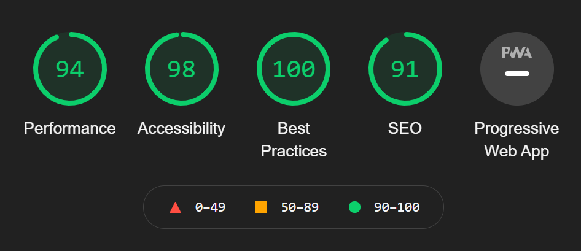
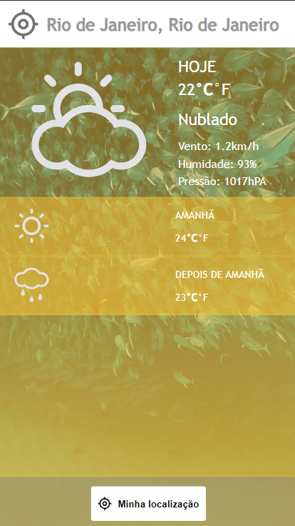

#  Desafio Charlie - Jonas Emanuel

   
## Requisitos para rodar o projeto:

- Docker

## Como rodar o projeto:

- Abrir terminar em uma pasta de preferência.
- Executar `git clone git@github.com:JonasEmanuel/challenge-charlie.git challenge-jonas-emanuel`
- Executar `cd challenge-jonas-emanuel`
- Executar `docker compose up` na pasta do projeto
- Accessar http://localhost:3000 no seu navegador de preferência

## Tecnologias usadas:

- ReactJS
- Typescript
- Webpack
- Styled Components (CSS-in-JS)
- Jest and React Testing Library
- ESLint (para validação de arquivos JS/TS estáticos e garantir o uso Style Guide Airbnb na escrita do código)

## O que pode melhorar:
- Fornecer um auto completar para o usuário no momento de digitar a localização desejada. Utilizar uma API como por exemplo a Places API do Google(É paga :/ ).
- Documentar os componentes da aplicação. (Utilizando Storybook por exemplo)
- Escrever testes E2E para assim atender toda a pirâmide de testes.

## Mudanças em relação a experiência proposta:
- A forma como o usuário alterna entre as unidades de temperatura está um pouco mais explicito e intuitivo do que foi pedido. Não fica tão claro pro usuário que ele pode alternar entre as unidades de medidas simplesmente clicando na temperatura. 
- Adição de um botão para o usuário informar a sua localização, pois não é uma boa prática de UX pedir a localização do usuário assim que o mesmo abre a aplicação. Pode gerar algum tipo de confusão no usuário.
- Adição de skeletons na aplicação para informar ao usuário que algo está sendo carregado.

## Erros cometidos durante o desenvolvimento:
- Não fazer todo o desenvolvimento da aplicação orientado a testes. Embora o coverage esteja OK o ideal é que o TDD seja executado e nesse caso o executei somente nas primeiras funcionalidades do projeto.
- Alguns commits tiveram muitas alterações, mais do que eu acho que deva ter em um único commit.

## Lighthouse

## Aplicação

