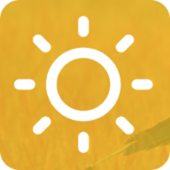
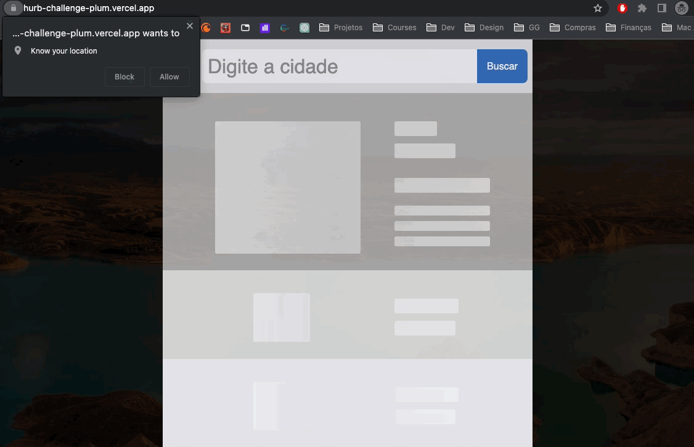

<h1 align="center">
    
     
    Hurb Challenge
</h1>

## ✨ Projeto

O Projeto mostra a previsão do tempo baseado na localização do usuário ou da localização que for inserida, envolve consumo da [API de geolocalização do navegador](https://developer.mozilla.org/en-US/docs/Web/API/Geolocation_API) para as coordenadas atuais, [OpenCageAPI](https://opencagedata.com/api) para conseguir dados da localização com base nas coordenadas ou conseguir as coordenadas com base na localização inserida e [OpenWeatherAPI](https://openweathermap.org/api) para as informações sobre o clima.

- Tempo aproximado para finalizar: 37h

[Mais Informações...](https://github.com/hurbcom/challenge-charlie)

### [Demonstração online](https://hurb-challenge-plum.vercel.app/)

<h1 align="center">
    
</h1>

## :office: Buildando versão de produção com Docker

:cloud: Clonar projeto

`$ git clone git@github.com:efraim-andrade/challenge-charlie.git && cd challenge-charlie`

🚀 Iniciar o projeto com docker no modo desenvolvimento

`$ docker-compose build`
`$ docker-compose up`

---
## :office: Usando Localmente versão de desenvolvimento

:cloud: Clonar projeto

`$ git clone git@github.com:efraim-andrade/challenge-charlie.git`

📦 Instalar dependências

`$ npm i`

🚀 Iniciar o projeto

`$ npm run dev`

---

### :scroll: Testes

Rodar testes automatizados

`$ npm run test`

---
## Padrões do projeto
### Tecnologias
- [NextJS](https://nextjs.org/)
- [Typescript](https://www.typescriptlang.org/)
- [Styled-components](https://styled-components.com/)
- [Jest](https://jestjs.io/pt-BR/)
- [Docker](https://www.docker.com/)

### Padrões de código
- [Eslint](https://eslint.org/)
- [Prettier](https://prettier.io/)
- [Idiomatic CSS](https://github.com/necolas/idiomatic-css)
---
## Decisões do projeto
### Segurança
- **API Routes**
  - Escolhi utilizar o [API Routes](https://nextjs.org/docs/api-routes/introduction) do NextJS para consumir as API's de terceiro por dois motivos, na API do bing para evitar o erro de CORS que impede de consumir direto no client e para não deixar as chaves de utilização do  [OpenCageAPI](https://opencagedata.com/api) e do [OpenWeatherAPI](https://openweathermap.org/api) expostas no front-end.

- **ENV**
  - Coloquei as chaves das API's no .env para utilizar no back, porém para fins de utilização do pessoal que for analisar o teste subi no repositório para a aplicação funcionar quando forem clonar, porém em uma situação real o .env não seria enviado para o repositório

### Usabilidade
- **Contraste das cores**
  - O amarelo apresentado no print do design não estava contrastando bem com as letras brancas das informações, optei por deixar mais escuro para deixar mais visível.

- **Limitação da API free do OpenCage**
  - Após dar uma olhada na API do [OpenCageAPI](https://opencagedata.com/api) verifiquei que a versão gratuita não fornece suporte a  [Fuzzy Search](https://www.techtarget.com/whatis/definition/fuzzy-search) (Buscar text por aproximação) oque torna inviável utilizar a estratégia de [Debounce](https://www.freecodecamp.org/news/javascript-debounce-example/) para apresentar sugestões de resultados enquanto for digitando no input de busca, a API só funciona colocando o nome da localidade inteiro.

- **Melhorando a usabilidade da busca**
  - Visando uma melhor usabilidade na hora de buscar a cidade optei por adicionar um botão de busca e limpeza do input tendo em vista que não temos um autocomplete na parte grátis da API de localidade. Também adicionei alguns loaders para mostrar um feedback enquanto a aplicação busca a localização e as informações da previsão do tempo.

- **Troca de tipo de temperatura entre Celsius e Fahrenheit**
  - No layout passado não estava muito claro que a parte da temperatura era uma área clicável então pegando como referência o layout do google resolvi adicionar a letra da temperatura que não estava sendo usada meio opaca pra demonstrar que não estava ativa e coloquei um ícone representando que é algo trocável.

- **Salvando estado do tipo e temperatura no local storage**
  - Resolvi adicionar a funcionalidade de salvar a informação do tipo da temperatura no [Local Storage](https://developer.mozilla.org/en-US/docs/Web/API/Window/localStorage) para ao recarregar a página a escolha do usuário seja mantido.
