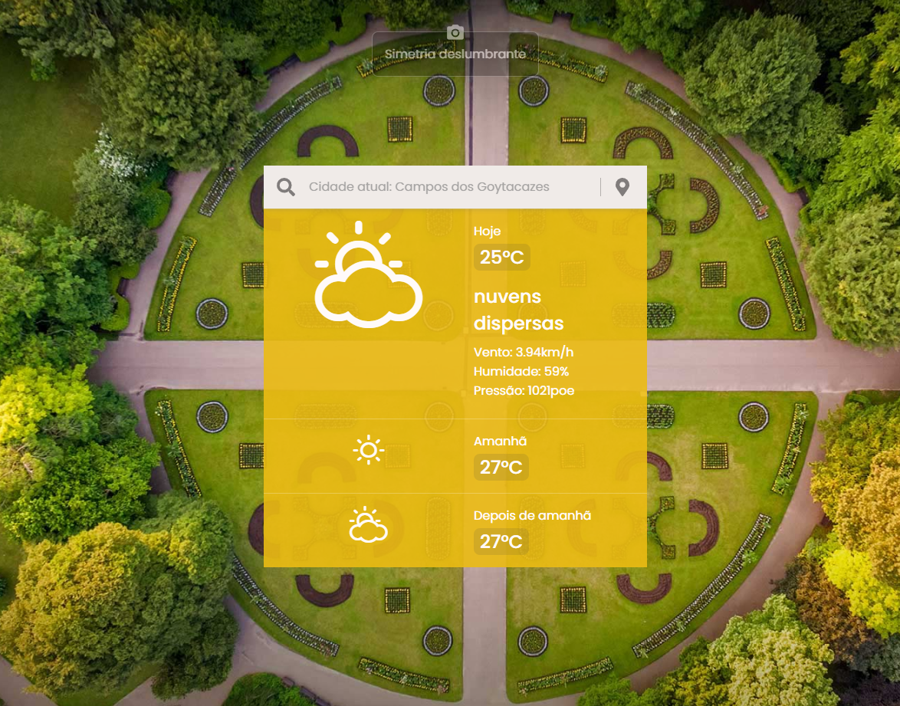
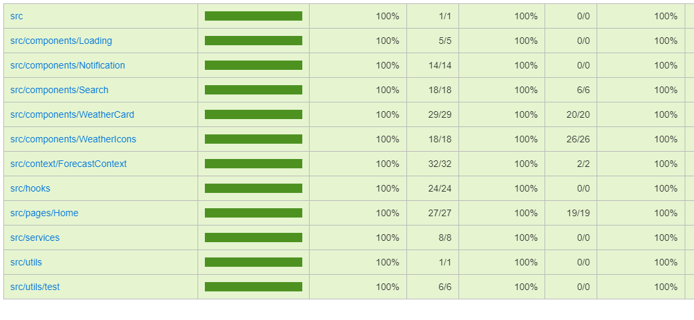

# Weather-app | Dados meteorológico [openweathermap](https://openweathermap.org/api)



## Sobre o Projeto

Projeto de nivelamento do processo seletivo Hurb

## Libs Usadas

- MSW
- styled components
- Storybook

## Testes Unitários



```
# Realizado os teste dos componentes e contexto da aplicaçao, localstorage...
# coverage dos testes
npm run test -- --coverage src

```

## Funcionalidades

- Home

  - :heavy_check_mark: Temperatura atual da cidade
  - :heavy_check_mark: curta descrição do tempo atual
  - :heavy_check_mark: Temperatura dos 2 proximos dias
  - :heavy_check_mark: medições de pressão, velocidade do vento e umidade

- Search

  - :heavy_check_mark: Pesquisar por nome da cidade

- Localstorage

  - :heavy_check_mark: Persiste a última pesquisa

- GeoLocation

  - :heavy_check_mark: utiliza a geolocalização do usuário quando é permitido

- UI
  - :heavy_check_mark: reponsivo na quebra de linhas com 768px
  - :heavy_check_mark: colocado dois novos botões da interface : local e search
    - lupa pra fazer o submit do input
    - local para fazer o match com a localização do usuário

## Como Rodar

Depois de estar dentro do repositório:

```

# Docker - Para ambiente de produção

# Api key do serviço openweathermap ela já está no .env

npm run prod

# output - http://localhost:8080/

```

```

# Docker - Para ambiente de Desevolvimento

# Api key do serviço openweathermap ela já está no .env

npm run dev

# output - http://localhost:3000/

```

Ambos compose irão rodar um serviço node para fazer a busca na api bing para retornar a foto para compor a interface

## Lib dos componentes | Storybook

```

#Storybook
npm run storybook

```


