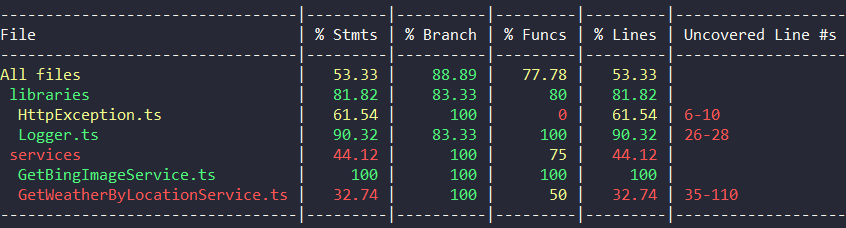
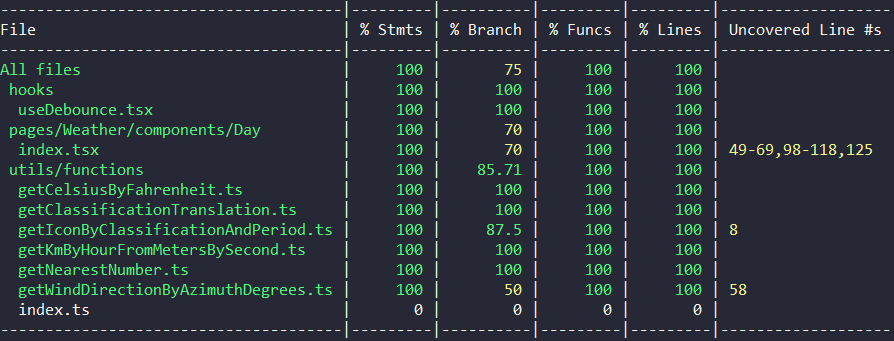

# Desafio Charlie
## ✨ O Projeto
O projeto consiste em uma aplicação React client-side para exibir a previsão do tempo filtrando por localidade ou coordenadas geográficas e uma API em Node que provê a integração com API's de terceiros devido a restrições de CORS presentes nos navegadores.

Veja quais foram os [requisitos para esse desafio](./docs/CHALLENGE.md). 

## 📜 Manual de execução

Para rodar essa aplicação localmente você pode seguir uma das três opções descritas a seguir.

### Opção 1) Rodando com docker compose

Requisitos de ambiente:
- [Docker](https://www.docker.com/products/docker-desktop) versão 20.10.7 ou superior

Após instalar os pré-requisitos, na raiz do projeto você pode rodar o seguinte comando para subir a aplicação:

```sh
docker compose up
```
> Espere subir os 3 containers e pronto, você já pode acessar a aplicação em: http://localhost:3000 😀

**Production Ready:** Se você deseja executar a versão built que vai rodar em produção, apenas entre nas pastas frontend e backend e execute individualmente em cada pasta o comando `docker compose up production`, respectivamente.

### Opção 2) Rodando manualmente

Requisitos de ambiente:
- [Node](https://nodejs.org/en/) versão 14.17.1 ou superior
- [Yarn](https://yarnpkg.com/) versão 1.22.10 ou superior

Primeiro, rode o comando `yarn` dentro das pastas /frontend e /backend para instalar as dependências

Após ter as dependências instaladas, para subir o backend, entre na pasta /backend e execute o comando `yarn dev`

Para o frontend é praticamente a mesma coisa, então entre na pasta /frontend e execute o comando `yarn dev`

> Espere a aplicação subir e pronto, você já pode acessar a aplicação em: http://localhost:3000 😀

**Production Ready:** Se você deseja executar a versão built que vai rodar em produção, apenas entre nas pastas frontend e backend e execute individualmente em cada pasta o comando `yarn build` e após `yarn start`, respectivamente.

### Opção 3) Rodando com docker run

Requisitos de ambiente:
- [Docker](https://www.docker.com/products/docker-desktop) versão 20.10.7 ou superior

Essa é pra quem gosta de ativar o modo raiz nível 4 😅 ou pra quando houver alguma restrição à usar o compose. Mas se você só quer rodar local mesmo recomendo usar a opção 1.

Primeiro precisaremos fazer a build da imagem do backend, pra isso rode:

```sh
docker build --file Dockerfile.back --tag backend --target back_development .
```

Agora vamos precisar repetir o mesmo processo mas agora para gerar a build da imagem frontend:

```sh
docker build --file Dockerfile.front --tag frontend --target front_development . 
```

Opcionalmente você pode subir uma instância de redis com o seguinte comando:
```sh
docker run --name charlieRedis  -p 6379:6379 -d redis redis-server --bind '0.0.0.0' 
```
> Caso você não suba essa instância a aplicação funcionará normalmente, porém sem os benefícios na velocidade da resposta da API com cache.

Após finalizar as builds, está na hora de subir os containers.

Para subir o backend, na raiz do projeto execute:
```sh
docker run -it --rm -v ${PWD}/backend:/app -v /app/node_modules -p 3333:3333 -e REDIS_HOST=host.docker.internal -e NODE_ENV=development backend
```

E por fim, para subir o frontend, na raiz do projeto abra outro terminal e execute:
```sh
docker run -it --rm -v ${PWD}/frontend:/app -v /app/node_modules -p 3000:3000 -e CHOKIDAR_USEPOLLING=true -e NODE_ENV=development frontend
```

> Espere subir os 2 containers e pronto, você já pode acessar a aplicação em: http://localhost:3000 😀


**Production Ready:** Se você deseja executar a versão built que vai rodar em produção, apenas troque o --target para `back_production` ou `front_production` quando for gerar a imagem, o resto do processo é o mesmo.

## 🕵️ Vulnerabilidades

- Não foi implementado nenhuma proteção a nível de aplicação contra ataques DDOS
  - Após realizar o deploy, seria importante restringir o CORS apenas para o domínio em que o site estivesse disponível para evitar que "redes zumbi" de botnets sejam usadas pra esse tipo de ataque contra nossa API.
- Por utilizar as bibliotecas em suas versões mais atualizadas, comandos como yarn audit não retornaram nenhuma vulnerábilidade, por isso é importante sempre manter as bibliotecas sempre atualizadas.

## ⌛ Tempo decorrido para execução das tarefas

> Tempo levado para finalizar: 42h 32m

- Configurar estrutura inicial do projeto (pastas + scripts webpack + testes) - 8h 15m

- Adicionar redis para cache de resposta (invalidar a cada uma hora)  - 1h

- Implementar design dos componentes (responsivo) - 6h 24m 

- Integração com api Bing para obter plano de fundo - 1h 40m

- Trocar ícone com base na classificação - 35m

- Integração com API OpenWeather/OpenCage para dados do clima + troca para fahrenheit. 16h 30m

- Obter coordenadas do browser e usar para fazer a primeira consulta ou não fazer a consulta - 1h

- Criar funcionalidade para o input de cidade - 1h 30m

- Abrir popup pedindo permissão para geolocalizaçao - 40m

- Fazer aplicação toda rodar em Docker com um simples comando - 3h

- Melhorar Readme.md - 2h

## Pontos tratados que considero importantes

### Resiliência e tolerância a falhas

- Se a aplicação backend não conseguir se conectar com o Redis para aumentar a performance nos endpoints, o fluxo continua normalmente obtendo os dados das API's OpenCage e OpenWeather.

### Melhorias de UX

- [implementado] Quando o usuário buscar por uma cidade, foi adicionado um efeito de rotação no ícone à esquerda do input e uma mensagem logo abaixo dizendo o status da busca (se não encontrou, se está buscando etc.).

- [sugestão] O contraste da cor branca da fonte sobre o fundo amarelo no tom especificado no design não está ideal e pode prejudicar a leitura do usuário, sugiro uma melhoria na cor desse amarelo ou alteração na cor da fonte e utilizar uma ferramenta como a [contrastchecker.com](https://contrastchecker.com/) para verificar se está atendendo as normas.

- [sugestão] As cores vermelho, azul e amarelo podem ser difíceis de trabalhar para não prejudicar a leitura de pessoas com daltonismo, preencher os fundos com essas cores não parece ser uma boa opção.

- [sugestão] Um input deve parecer um input, nos testes que realizei com pessoas próximas ninguém percebeu que o lugar onde altera o nome da cidade era um input, parece mais um "header" com um título apenas, o que prejudica a usabilidade.

### Escolhas Técnicas

- Utilizei o próprio Context API do React ao invés de usar Redux porque se trata de uma aplicação pequena e não houve necessidade de espelhar um estado em diversos componentes, usar Redux nesse projeto só aumentaria a complexidade.

- Utilizei Typescript como linguagem de programação no front e no back para utilizar das de features mais novas e ter o apoio do intelisense durante o desenvolvimento, evitando erros e comportamentos indesejados.

- Mantive a arquitetura bem simples, utilizando no backend alguns patterns do Domain Drive Design (DDD) como Service Pattern, controllers, middlewares, etc. No frontend usando Custom Hooks e na estilização mantendo ao máximo próximo dos padrões ITCSS e RSCSS.

### Testes unitários e testes de integração

Para a maioria dos casos eu utilizei da prática TDD criando os testes antes de criar a funcionalidade. Tanto no frontend quanto no backend implementei os testes que ao meu ver faziam sentido sem implementados.

- Para gerar cobertura de testes rode `yarn test --coverage`


**Cobertura de testes do back-end:**



---

**Cobertura de testes do front-end:**


## Instruções para desenvolvedores

Selecionei algumas informações importantes e adicionei no arquivo [CONTRIBUTING.md](./docs/CONTRIBUTING.md) para o próximo que for manutenir ou implementar algo nesse projeto.

## Considerações finais

- Achei interessante criar o projeto react com webpack, fica bem mais flexível, já havia usado webpack mas na época que eu nem usava react ainda, até o momento só hávia criado projetos react pra web com o create react-app

- Não encontrei a fonte correta, então selecionei uma semelhante.

- Não descobri por que o modo watch não está funcionando enquanto uso docker, as alterações na maquina são refletidas dentro do docker pelo volume, porém o webpack não re-compila quando ocorre as alterações.

Fico a disposição para tirar dúvidas e sempre estarei aberto a criticas construtivas e sugestões de melhorias, obrigado pela atenção!

Contato: gabrieldnrodrigues@gmail.com
Linkedin: https://www.linkedin.com/in/gabrieldissotti/