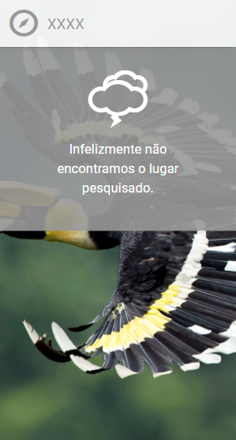
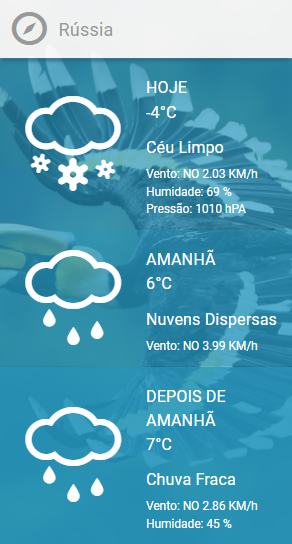
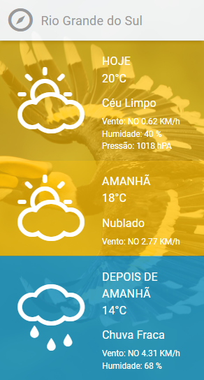
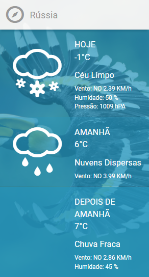

# Challenge Charlie

### Descrição

Criação de um projeto que possa realizar previsões do tempo por geolocalicação e busca pelo nome.


## Layout
<p align="center">
  
  
  
</p>
## Escolhas Técnicas

- **Meterial-UI** - Utilizado para construção do layout.
- **NodeJS** - Utilizado para construir o backend da aplicação, para solucionar o problema de  `CORS policy` e para acesso único também, foi criado um minimo de segurança, é necessário enviar no header uma chave de autenticação, para então poder consumir a API.

## Explicação do funcionamento do componente
O componente é configurado pelo arquivo "describes.json", ou seja, realizada a a leitura dessa arquivo para construção de labels e exibição do icone para os respectivos dias.
A ideia e tentar deixar o máximo flexivel, por exemplo, no layout original não existe a exibição do icone de temperatura para os dias "amanhã" e "depois de amanhã", dessa forma basta eu informar se eu quero exibir o icone somente alterando a propriedade para o respectivo dia..

```json
 weather.day[x].config.showIcon = true
``` 

## Exemplo de configuração do componente
```
{
    "weather":{
        "messages":{
            // Mensagem quando não encontrar um lugar.
            "placeNotFound":"Infelizmente não encontramos o lugar pesquisado.", 
            // Texto place holder do campo de busca
            "placeHolder":"Informe um lugar."
        },
        //Configurações dos dias
        "days":{
            "today":{
                "config":{
                    // Name do dia
                    "name":"Hoje",
                    // Exibir o ícone, se não houve a tag não será exibido.
                    "showIcon":true
                },
                // Definição dos labels com seus respectivos campos
                // No momento só aceita campos que retornam da API
                "labels":{
                    "description":"{description}",
                    "wind_speed":"Vento: NO {wind_speed} KM/h",
                    "humidity":"Humidade: {humidity} %",
                    "pressure":"Pressão: {pressure} hPA"
                }
            },
            "tomorrow":{
                "config":{
                    // Name do dia
                    "name":"Amanhã",
                    // Exibir o ícone, se não houve a tag não será exibido.
                    "showIcon":true
                },
                // Definição dos labels com seus respectivos campos
                // No momento só aceita campos que retornam da API
                "labels":{
                    "description":"{description}",
                    "wind_speed":"Vento: NO {wind_speed} KM/h"
                }
            },
            "after_tomorrow":{
                "config":{
                    // Name do dia
                    "name":"Depois de amanhã",
                    // Exibir o ícone, se não houve a tag não será exibido.
                    "showIcon":false
                },
                // Definição dos labels com seus respectivos campos
                // No momento só aceita campos que retornam da API
                "labels":{
                    "description":"{description}",
                    "wind_speed":"Vento: NO {wind_speed} KM/h",
                    "humidity":"Humidade: {humidity} %"
                }
            }
        }
    }
}
```

## Resultado com a configuração acima
<p align="center">
  
</p>

## Rodando o projeto
```
  npm start
```

## Rodando os tests
```
  npm run test
```
