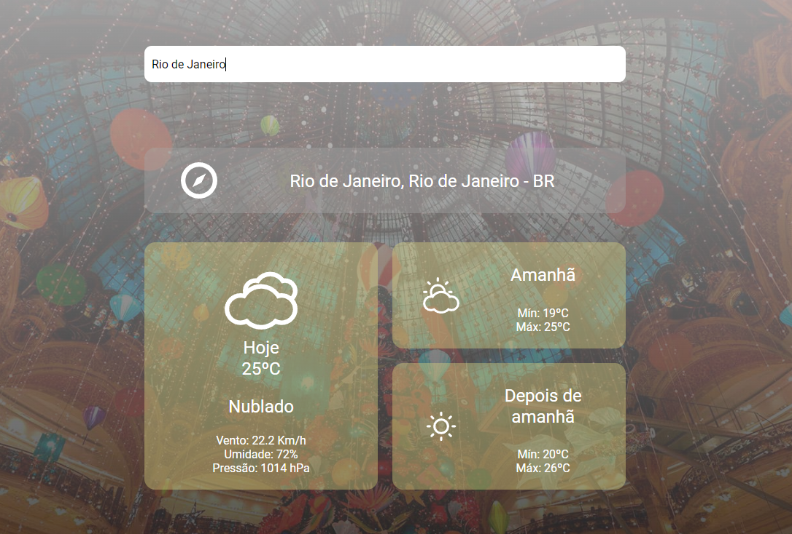

# Desafio Hurb

Desafio técnico para o processo seletivo da Hurb. A aplicação consiste em
um website de previsão do tempo que mostra a previsão para o dia atual e para os
dois dias seguintes.

## Screenshots

<p align="center">
  
</p>

## Tecnologias

- [ReactJS](https://reactjs.org)
- [Axios](https://axios-http.com/ptbr/docs/intro)
- [styled-components](https://styled-components.com/)
- [TypeScript](https://www.typescriptlang.org/)
- [Webpack](https://webpack.js.org/)
- [Babel](https://babeljs.io/)
- [React Testing Library](https://testing-library.com/docs/react-testing-library/intro)
- [Toastify](https://fkhadra.github.io/react-toastify/introduction)
- [React Spinners](https://mhnpd.github.io/react-loader-spinner/)

## Sobre o projeto

- No carregamento da pagina são coletadas as coordenadas geográficas do usuário para a busca inicial da previsão do tempo.

- Para a consulta da previsão do tempo e para converter a latitude e longitude em uma localidade foi utilizada a API do [OpenWeather](http://api.openweathermap.org).

- A imagem de fundo é coletada a partir da [Bing API](https://www.bing.com/HPImageArchive.aspx?format=js&idx=0&n=1&mkt=pt-US).

- Quando o usuário clica em qualquer card é convertida a temperatura de Celcius para Fahrenheit ou de Fahrenheit para Celcius.

## Rodando a aplicação

Depois de clonado o projeto execute os seguintes comandos:

Instalando as dependências

```bash
yarn install
```

Levantando o servidor

```bash
yarn serve
```

Build

```bash
yarn build
```

Levantando o servidor dentro de um container Docker

```bash
yarn compose-dev
```

Build do projeto dentro de um container Docker

```bash
yarn compose-prod
```

Testes unitários

```bash
yarn test
```

Testes unitários observando alterações no código

```bash
yarn test:watch
```

## Melhorias

- Mensagem de erros atravez da lib [Toastify](https://fkhadra.github.io/react-toastify/introduction)
- Implementado loader para quando a aplicação estiver buscando os dados de uma localidade
- Realizei o projeto com um layout diferente do exemplo, visando apresentar um projeto com a minha identidade.

## Contato

pfrare.tads@gmail.com
