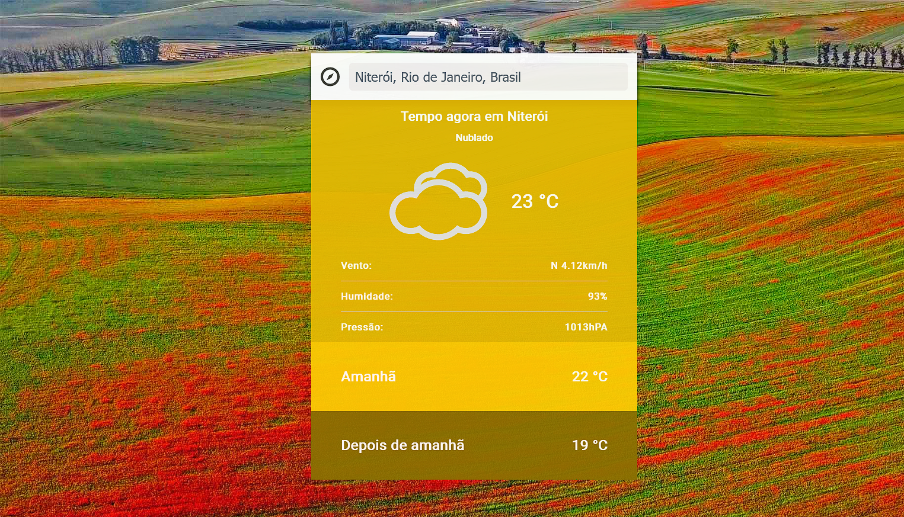
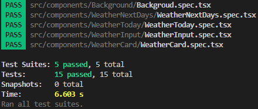
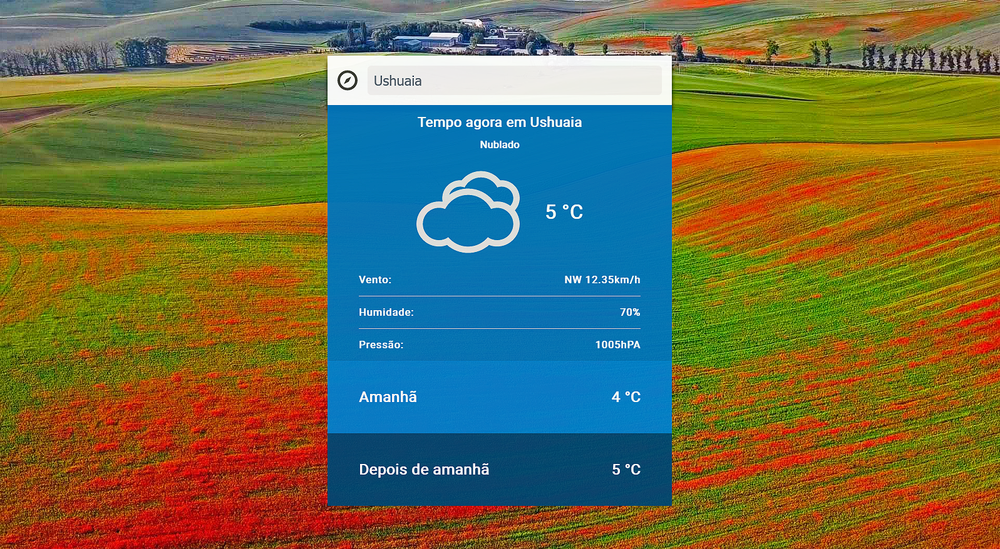
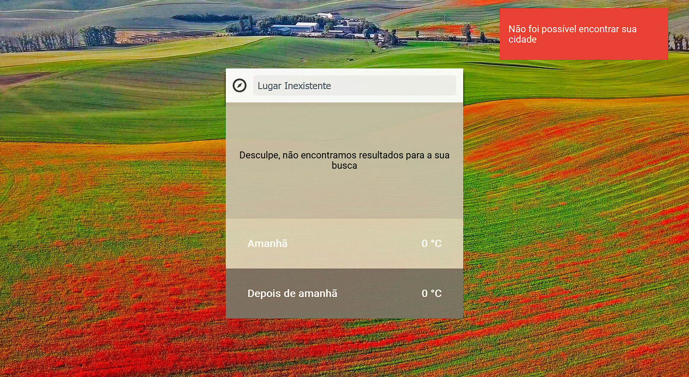

# :sunny: Challenge Charlie | Matheus Baldas

O microsite "Challenge Charlie" tem o objetivo de fornecer a previsão do tempo. No primeiro momento, o usuário é informado
da previsão do tempo para o local onde se encontra ao fornecer seus dados de localização via browser. Existe um input caso o usuário queira
informações de outros lugares fora o seu próprio. São fornecidas informações mais detalhadas do dia atual, além da previsão de temperatura para os próximos dois dias.

# :recycle: Mudanças propostas

O layout da forma que foi proposto trata todas as informações com o mesmo grau de importância. Entretanto, quando um usuário entra num site
de previsão do tempo a informação que ele quer obter é, na maioria das vezes, sobre a temperatura do local. Por esse motivo, eu propus
uma mudança nesse sentido que consiste no destaque da temperatura e do ícone do clima no componente principal. Informações que são mais específicas como o vento, humidade e pressão são mostrados abaixo da temperatura. Eu utilizei como inspiração os layouts dos principais sites de previsão do tempo, como: ClimaTempo, Weather.com e o Widget de previsão do tempo do Google.



# :hammer: Tecnologias

- [React](https://reactjs.org/)
- [Typescript](https://www.typescriptlang.org/)
- [Zustand](https://github.com/pmndrs/zustand)
- [SASS](https://sass-lang.com/)
- [Webpack](https://webpack.js.org/)
- [Babel](https://babeljs.io/)
- [Docker](https://www.docker.com/)
- [Jest](https://jestjs.io/)

## :white_check_mark: API's utilizadas

- [Open Cage](https://opencagedata.com/api)
- [Open Weather](https://openweathermap.org/api)
- [Bing](https://www.bing.com/HPImageArchive.aspx?format=js&idx=0&n=1&mkt=pt-BR)

# :wrench: Instalação

Antes de tudo, esse projeto utilizou do cors anywhere para fazer uma requisição, então antes de instalar é necessário solicitar acesso temporário
a ferramenta no link: https://cors-anywhere.herokuapp.com/corsdemo.

Para rodar localmente:

```bash
  git clone https://github.com/mbaldas/challenge-charlie
  cd challenge-charlie
```

```bash
  npm install
  npm start
```

Para rodar com docker:

```bash
  git clone https://github.com/mbaldas/challenge-charlie
  cd challenge-charlie
```

```bash
  docker-compose -f docker-compose.dev.yml up
```

Foi utilizado multistage building, então além do docker compose referente ao ambiente de desenvolvimento que foi utilizado acima,
existe também o docker compose de produção.

# :robot: Testes

Para rodar os testes:

```bash
  npm run test
```

A ferramenta utilizada foi o Jest como motor de testes e react testing library como ferramenta auxiliar para o desenvolvimentos dos mesmos.

Resultados dos testes



# :framed_picture: Funcionamento

Cidade encontrada, clima ameno.


Cidade encontrada, clima frio.



Cidade encontrada, clima quente.


Cidade não encontrada.



# :construction: Dificuldades e Melhorias

- Webpack

  - Minhas maiores dificuldades no projeto foram relacionadas a configurações do Webpack. Todos os projetos que trabalhei até hoje com react, tanto profissionais quanto projetos pessoais, tinha utilizado CRA para iniciar a aplicação, então todas as configurações para o Webpack funcionar (loader de sass, svg, typescript) foram complexas de se configurar no início.

- CORS
  - Outro ponto de atenção fica em relação a forma com que o CORS foi tratado. Utilizei de uma API para ultrapassar o CORS ao invés de "ultrapassar por conta própria", algo que não é ideal para produção. No futuro o ideal seria configurar um proxy para que as requisições funcionem corretamente.

# Licença

[](https://github.com/tterb/atomic-design-ui/blob/master/LICENSEs)
