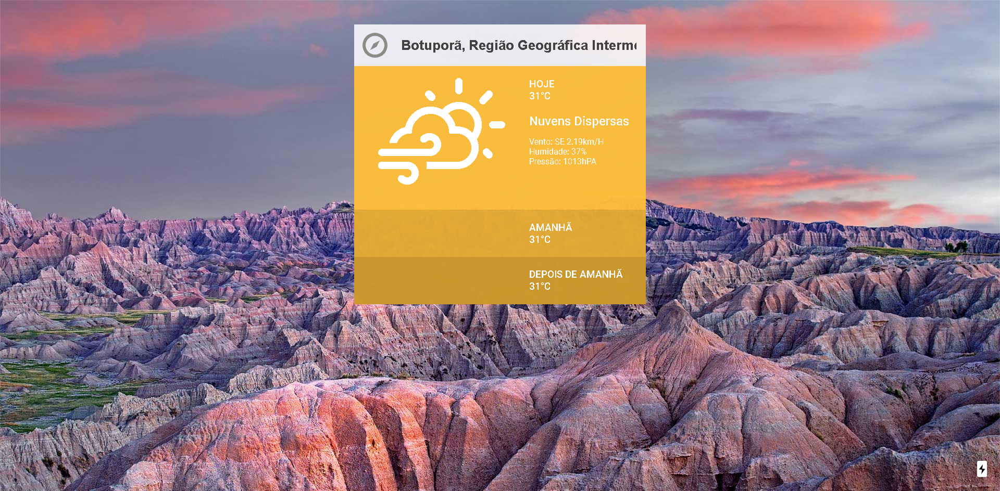

# Challenge Charlie - Mateus Barbosa



### 🗃 Requisitos

São necessários os seguintes programas:

- Git
- Docker
- Docker Compose
- Node.js (Opcional caso queira prosseguir sem o docker)

## Instalação

```sh
yarn install
```

#### Rodando a aplicação pelo package.json

Ambiente de desenvolvimento (localhost:4000)

```sh
yarn dev
```

Ambiente de Produção (localhost:3000)

```sh
yarn build
yarn start
```

#### Rodando a aplicação com Docker

Ambiente de desenvolvimento (localhost:4000)

```sh
docker-compose up
```

Ambiente de Produção (localhost:3000)

```sh
docker-compose -f docker-compose.prod.yml up
```

### Vulnerabilidades Encontradas

A vulnerabilidade encontrada foi a exposição de chaves de acesso as APIs de geolocalização e clima no front-end.

### Escolhas Técnicas

**Next.js** - Foi utilizado esta ferramenta para renderização estática e de servidor híbrida, suporte TypeScript, agrupamento inteligente, pré-busca de rota.

**TypeScript** - A decisão de usar TypeScript foi para, em ambiente de desenvolvimento, ter mais clareza do que está sendo passado como argumento, retorno e etc. 

**ESLint e Prettier** - Foram utilizadas para o ambiente de desenvolvimento, tenha o código esteja padronizado e organizado sempre da mesma maneira.

<hr/>

<p align="center">
    com 🦎 Mateus Barbosa 2020
</p>