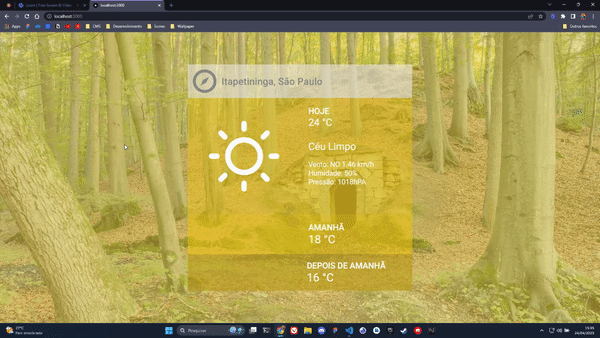
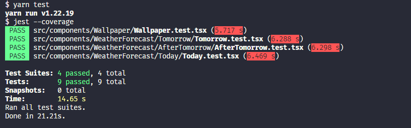

<div align="left">
    
</div>

<br/>

<div align="center">
    
</div>

<br/>

<div align="center">
    <h1>Challenge Charlie</h1>
    <h3>Projeto em NextJS para Previsão do Tempo</h3>
    <p align="center">Uma aplicação Web responsiva desenvolvida em <a href="https://nextjs.org/">NextJS</a> que consulta a API <a href="https://openweathermap.org/">Open Weather</a> para pesquisar a previsão do tempo.
    </p>
</div>

<div align="center">
    
    
    
    
    
    
    
</div>

<br/>

<div align="center">
    <a href="#tecnologias">Tecnologias</a> •
    <a href="#como-usar">Como usar</a> •
    <a href="#arquitetura">Arquitetura</a> •
    <a href="#decisões-técnicas">Decisões Técnicas</a> •
    <a href="#desafios">Desafios</a> •
    <a href="#melhorias">Melhorias</a>
</div>

<br/>

<div align="center">
    
</div>

<br/>

**Demo FIGMA:** [**https://www.figma.com/challenge-charlie**](https://www.figma.com/file/SeLoG8Ky6ZIzOtCKGAmF8w/challenge-charlie?node-id=0%3A1&t=wwxWFPAGt7NvvDr9-1)

**Demo FRONT-END:** [**https://**](https://)

<br/>

# Tecnologias
#### Linguagens e Ferramentas:
- [Next.js](https://nextjs.org/)
- [TypeScript](https://www.typescriptlang.org/)

#### Front-end:
- [Chakra UI](https://chakra-ui.com/)

#### Testes:
- [Jest](https://jestjs.io/)
- [Testing Library](https://testing-library.com/)

#### Padronização de Código:
- [ESLint](https://eslint.org/)
- [Prettier](https://prettier.io/)

#### Auxiliares
- [Nookies](https://github.com/maticzav/nookies)
- [React Hook Form](https://react-hook-form.com/)

<br/>

# Como usar
**Clone o projeto e acesse a pasta:**

```bash
$ git clone git@github.com:vitoremanuelqf/challenge-charlie.git && cd challenge-charlie
```

**Siga os passos a baixo para rodar a aplicação localmente:**

```bash
# Certifique-se de que todas as variáveis de ambiente estão com as chaves das APIs ativas.

# Instale as dependências:
$ yarn

# Inciar a aplicação
$ yarn start
```

**Para rodar os testes:**
```bash
# Instale as dependências:
$ yarn

# Rodar o comando de teste:
$ yarn test
```

<br/>

<div align="left">
    
</div>

<br/>

# Arquitetura

```shell
public/
|---- images/
src/
|---- assets/
|---- components/
|---- contexts/
|---- functions/
|---- hooks/
|---- pages/
|---- styles/
|---- tests/
|---- types/
```

<br/>

# Decisões Técnicas
**Next.js:**
<p align="left">O Next.js é conhecido por oferecer suporte para renderização do lado do servidor, o que pode melhorar significativamente o desempenho da página, especialmente em conexões de internet mais lentas. Quanto a performance, o Next.js é projetado para oferecer o melhor desempenho, utilizando estratégias como o pré-carregamento de páginas e o lazy loading para melhorar o tempo de carregamento.</p>

<br/>

**ChakraUI:**
<p align="left">O ChakraUI permite a criação de interfaces de usuário rapidamente, sem precisar escrever CSS personalizado ou estilizar cada componente individualmente. Isso economiza tempo e aumenta a produtividade. O framework também se preocupa com a acessibilidade, e seus componentes são projetados com esse recurso em mente. Isso significa que você pode criar interfaces de usuário que sejam acessíveis.</p>

<br/>

**React Hook Form:**
<p>O React Hook Form é projetado para ser flexível e escalável, permitindo que os desenvolvedores escolham as bibliotecas de UI que desejam usar e personalizem as funcionalidades de validação e manipulação de dados para atender às suas necessidades específicas, sendo assim, é possível criar formulários em React de forma mais rápida e fácil, reduzindo a quantidade de código necessário e melhorando a eficiência e desempenho do aplicativo.</p>

<br/>

**Nookies:**
<p>Nookies é uma biblioteca de gerenciamento de cookies em JavaScript que pode ser utilizada em aplicações web. Ela permite que desenvolvedores gerenciem cookies no lado do cliente de forma fácil e flexível.</p>

<br/>

# Desafios
- <p>Contornar o erro de CORS ao consumir a API do bing, em meio a pesquisas encontrei a solução com a implementação da feature de <a href="https://nextjs.org/docs/api-routes/introduction">API Routes do NextJS</a></p>

- <p>Elaborar e implementar os testes com  <a href="https://nextjs.org/docs/api-routes/introduction">Jest</a> e <a href="https://nextjs.org/docs/api-routes/introduction">Testing Library</a></p>

<br/>

# Melhorias
**Alert:**
- <p>O uso de alertas na web é uma forma eficaz de exibir informações importantes ou notificações aos usuários de um site ou aplicação web.</p>

<br/>

**Skeleton:**
- <p>O uso de skeleton para loading (ou carregamento) é uma técnica que pode melhorar significativamente a experiência do usuário em aplicações web ou mobile, especialmente em situações em que há carregamento assíncrono de conteúdo.</p>

<br/>

**Sugestões de Pesquisa no Input:**
- <p>O uso de sugestões de autocompletar (ou autopreencher) em campos de entrada de formulários em aplicações web ou mobile pode ajudar a melhorar a experiência do usuário de várias maneiras, uma delas é evitar erros de digitação e garantir que os dados inseridos estejam precisos e consistentes.</p>

- <p>Para implementar as sugestões de autopreenchimento, foi necessário integrar a API de localidades dos serviços de dados do <a href="https://servicodados.ibge.gov.br/api/docs/localidades">IBGE</a>. A integração com a API de localidades do <a href="https://servicodados.ibge.gov.br/api/docs/localidades">IBGE</a> foi fundamental para viabilizar as sugestões de autopreenchimento em nosso sistema. Por meio dessa integração, conseguimos acessar informações precisas e atualizadas sobre as localidades do país, o que nos permitiu fornecer sugestões relevantes e confiáveis aos usuários.</p>

<br/>

# Contato

Qualquer dúvida, sugestão ou crítica estarei à disposição!

**Obrigado pela oportunidade!**

E-mail: **vitoremanuelqf@gmail.com**

LinkedIn: [**https://www.linkedin.com/in/vitoremanuelqf**](https://www.linkedin.com/in/vitoremanuelqf/)