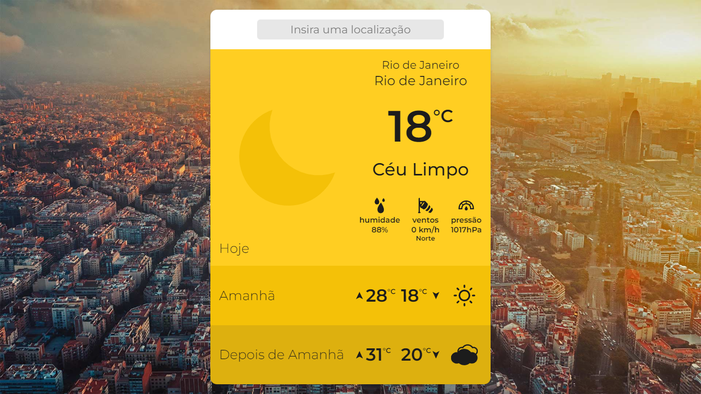

# Challenge Charlie

<h3 align="center"> ☁️ Previsão do tempo dinâmica e com um visual agradável ☁️ </h3>


 
<div align="center">


</div>
<div align="center">


</div>
<br/>

Esse é um microsite de previsão do tempo construído com `React`, seguindo as diretivas do Desafio Charlie da Hurb, que automaticamente pega a localização do usuário
e exibe a condição atual do tempo e a previsão para os próximos dois dias na localidade através da API da `OpenWeather`. Além disso, é possível verificar a previsão de outros lugares do mundo usando a 
barra de pesquisa.

---

## 📖 Índice
1. [Funcionalidades](#-funcionalidades)
2. [Escolhas no desenvolvimento](#-escolhas-no-desenvolvimento)
    1. [Typescript](#typescript)
    2. [Layout](#layout)
    3. [Zustand](#zustand)
    4. [Immer](#immer)
    5. [TailwindCSS](#tailwindcss)
    6. [Observações](#observa%C3%A7%C3%B5es)
3. [Instalação](#-instalação)
4. [Execução](#%EF%B8%8F-execução)
5. [Testes](#-testes)

## 🌟 Funcionalidades
* 🧭 Geolocalização automática
* 🌎 Pesquisa global de localidades
* 🌡️ Temperaturas em Celsius ou Fahrenheit
* 🎨 Tema dinâmico que muda de acordo com a temperatura do local 
* 🖼️ Fundo dinâmico que muda todos os dias
* ♿ Configurado com acessibilidade em mente

## 🧠 Escolhas no desenvolvimento
### Typescript
Para ser avisado sobre problemas de tipagem no compile time, foi escolhido o ```Typescript``` como linguagem, transpilado com ```Babel```.

### Layout
O layout foi modificado para criar uma hierarquia visual entre as informações mais relevantes e para criar um fluxo de leitura mais confortável na aplicação. No ambiente mobile, foi omitido a imagem de fundo do Bing para evitar clutter ou possíveis perdas de leitura se as informações fossem colocadas contra um fundo transparente para que a imagem de fundo ainda aparecesse.

### Zustand
Para evitar prop drilling e ter acesso global aos estados da aplicação, foi preciso escolher um gerenciador de estados, nesse processo o ```Zustand``` foi escolhido pela sua simplicidade de sintaxe e facilidade de uso.

### Immer
Em conjunto com o ```Zustand```, foi usado o ```Immer```, que permite uma manipulação mais fácil de estados aninhados sem quebrar o príncipio da imutabilidade do estado e o uso repetitivo do operador spread ```(...)```.

### TailwindCSS
O ```Tailwind``` foi o método escolhido para estilização da aplicação devido a velocidade de iteração e por facilitar a estilização dependendo do estado da aplicação, já que usa diretamente classNames.

### Observações
* Se tratando das chaves de API armazenadas como variáveis de ambiente, o arquivo .env faz parte do repositório apenas por questão de praticidade de uso da aplicação clonada. Se esse fosse um aplicativo em produção, as chaves precisariam ser manualmente preenchidas para executar a aplicação

## 📦 Instalação
Para clonar o projeto, execute o comando:
```bash
git clone https://github.com/jpsaiago/challenge-charlie.git
```
Depois mude seu terminal para o diretório que foi criado do projeto e execute:
```bash
yarn -OU- npm install
```
Para instalar as dependências do projeto.

## ⚙️ Execução
Para iniciar o ambiente de desenvolvimento através do ```Node```, basta usar o comando:
```bash
npm start -OU- yarn run start
```
A aplicação será levantada na porta 4000 com hot reload e source maps ativados.

Para executar a aplicação em produção, não é preciso instalar as dependências, mas é preciso ter o ```Docker``` instalado. O comando para verificar se ele existe na máquina é:
```bash
docker -v
```
Feito isso, basta executar:
```bash
npm compose-prod -OU- yarn run compose-prod
```
A aplicação será levantada na porta 4000 minificada no modo de produção.

Existem também códigos para criar o pacote do webpack
```bash
npm build -OU- yarn run build
```
e para levantar o container no modo de desenvolvimento
```bash
npm compose-dev -OU- yarn run compose-dev
```

## 🧪 Testes
