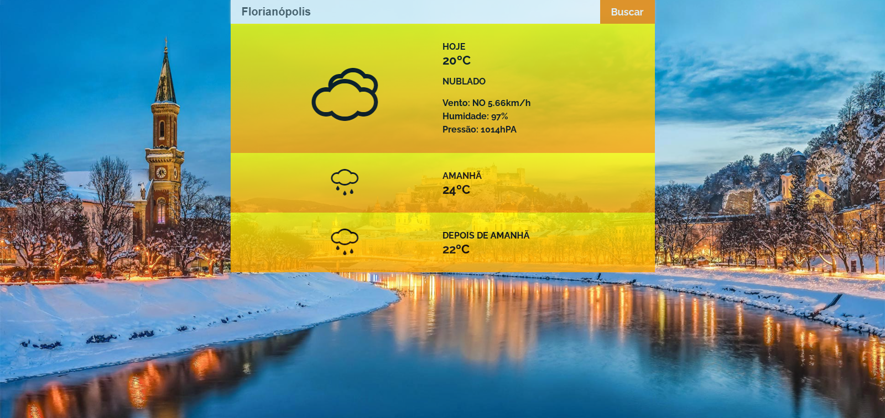

##  Hurb Challenge | Pamela Santos
Aplicação que exibe a previsão do tempo de acordo com a geolocalização que for ativada através do navegador ou caso o usuário não queira ativá-la, a localização poderá ser digitado por ele.

#### APIs utilizadas
- [Open Weather](https://openweathermap.org/api)
- [OpenCage](https://opencagedata.com/api)
- [Bing](https://www.bing.com/HPImageArchive.aspx?format=js&idx=0&n=1&mkt=pt-BR)

#### Tecnologias utilizadas
- Aplicação desenvolvida com [create-react-app](https://create-react-app.dev/)
- Estilização com [sass](https://sass-lang.com/)

#### Fontes utilizadas
- Para os ícones: [Meteocons](https://www.alessioatzeni.com/meteocons/)
- Para os textos exibidos na aplicação: Raleway importada do [Google Fonts](https://fonts.google.com/)

#### Requisitos para rodar a aplicação
- Necessário ter [node](https://nodejs.org/en/) instalado na máquina.
- Toda a aplicação se encontra na pasta **hurb-challenge**, e para funcionar corretamente, os comandos listados a seguir precisam ser executador dentro dessa pasta.
- Criar um arquivo `.env.local` com as chaves necessárias das APIs **Open Weather** e **OpenCage** nesse formato:

    REACT_APP_OPEN_WEATHER_KEY="{#value}"
  REACT_APP_OPEN_CAGE_DATA_KEY="{#value}"
- Rodar o comando `npm install` para instalar todas as dependências utilizadas na aplicação
- O projeto abrirá em localhost na porta `:3000` após rodar `npm start`
- Para gerar os arquivos para produção, necessário rodar `npm build`

#### Problemas ocorridos
- Não consegui deixar a aplicação rodando com o Docker. Tive alguns problemas na instalação e não tenho muito conhecimento nesse tópico.
- Para extrair a imagem de fundo da API do Bing, ocorreram alguns problemas de CORS, mas consegui ajustar buscando uma alternativa na internet que permite a extração desses dados.